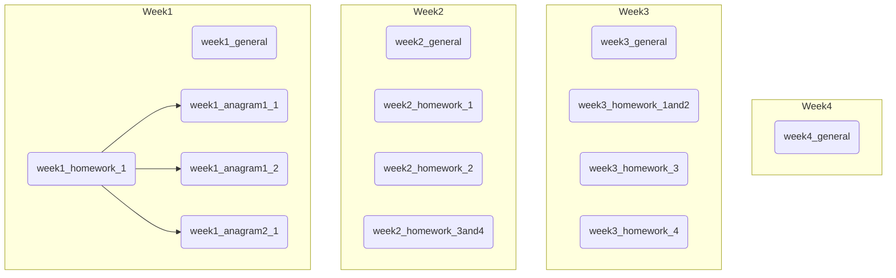

# The Strucuture of this repository

現在のmain branch内の各directlyは以下のようになっています。

# Repository Explanation

## general

* homework_summary: 宿題の提出ファイルについての説明（目標、方針、メゾット、工夫した点など）を見てもらう意識でわかりやすく書く！取り組んだ中で出てきた疑問点。
* classmemo: 授業中に学んだこと、気になったこと。
* review: メンターさんとの面談、授業での宿題のreviewで学んだこと。自分のコードや他人のコードを読んで、気になったところや真似したいと思ったこと。

## homework
* 詳しい内容や構造については、general内のhomework_summaryをご覧ください。

