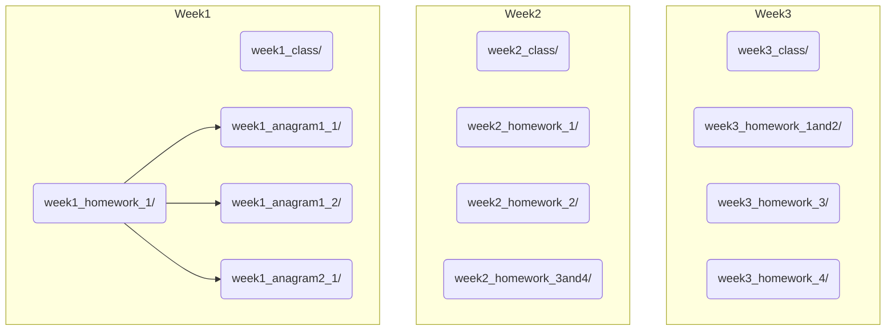

# The Strucuture of this repository
* main branch内の各directlyは以下の通りです。

```mermaid
graph BT
    subgraph Week3
        direction LR
        W3C(week3_class/)
        W3H12(week3_homework_1and2/)
        W3H3(week3_homework_3/)
        W3H4(week3_homework_4/)
    end

    subgraph Week2
        direction LR
        W2C(week2_class/)
        W2H1(week2_homework_1/)
        W2H2(week2_homework_2/)
        W2H34(week2_homework_3and4/)
    end

    subgraph Week1
        direction LR
        W1C(week1_class/)
        W1A1(week1_anagram1_1/)
        W1A2(week1_anagram1_2/)
        W1A3(week1_anagram2_1/)
        W1H1(week1_homework_1/) --> W1A1 & W1A2 & W1A3
    end
```
