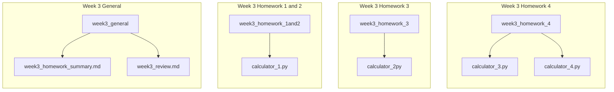

# Week3 Homework　Summary

## week3　各レポジトリの構成



## 各レポジトリの説明

---
### week3_homework_1and2


1.**目標**
* Homework 1: 掛け算と割り算の機能を追加する。（デバックの原則、モジュール化の原則を意識しながら）
* Homework 2: 網羅的なテストケースを追加する。

2.**提出ファイルの説明**
* [calculator_1.py](https://github.com/nzhzxnk/STEP/blob/main/week3_homework_1and2/calculator_1.py)
* サンプルコードに対して以下の変更・追加を行った.
  
    1. 掛け算と割り算への対応
    * read_asterisk関数: '*'を読み取り、{'type': 'ASTERISK'}）というtokenを返し、indexを1つ進める関数を作成した。
    * read_slash関数: '/'を読み取り、{'type': 'SLASH'}というtokenを返し、indexを1つ進める関数を作成した。
    * tokenize関数: read_asterisk関数、read_slash関数を用いてtokenを読み取り、tokensリストに追加する機能を追加した。 
    * evaluate関数: 掛け算と割り算を他の演算子よりも優先して処理するための機能を追加した。以下に該当部のコードを示す。
    * 現在のindexに含まれる文字が'*'である場合、index-1に含まれる数字にindex+1に含まれる数字を掛けた値をindex+1に格納する。
    * 現在のindexに含まれる文字が'/'である場合、index-1に含まれる数字でindex+1に含まれる数字を割った値をindex+1に格納する。
    * index-1とindexには空辞書('{}')を代入しておき、後の処理で削除する。
    * 例えば"2*3"に対して処理を行うと、tokensは[{}, {}, {'type':'NUMBER', 'number':'6'}]となる。
    ```python3 []
    while index < len(tokens):
        if tokens[index]['type'] == 'ASTERISK': # If '*' exsists in the line, evaluate and put the result in tokens[index+1].
            if tokens[index - 1]['type'] == 'NUMBER' and tokens[index + 1]['type'] == 'NUMBER':
                multi_ans = tokens[index-1]['number']*tokens[index+1]['number']
                tokens[index - 1] = {}
                tokens[index] = {}
                tokens[index + 1] = {'type':'NUMBER', 'number':multi_ans}
            else: # If an unexpected symbol exists in the line, the program is crashed and show errorcode(1). 
                print('Invalid syntax')
                exit(1)
        elif tokens[index]['type'] == 'SLASH': # If '/' exsists in the line, evaluate and put the result in tokens[index+1].
            if tokens[index - 1]['type'] == 'NUMBER' and tokens[index + 1]['type'] == 'NUMBER':
                div_ans = tokens[index-1]['number']/tokens[index+1]['number']
                tokens[index - 1] = {}
                tokens[index] = {}
                tokens[index + 1] = {'type':'NUMBER', 'number':div_ans}
            else:
                print('Invalid syntax')
                exit(1)
        index += 1
    tokens = [token for token in tokens if token] # Delete empty dicts.
    ```
  
    2. 様々な入力例への対応
    * 空白の処理: 入力された式から空白（スペース）を削除するために正規表現を用いた。test関数とメインのwhileループ内に`e.sub(r'\s+', '', line)`が追加した。"1 + 2"のような入力も有効になる。
    * 無効な式、負の数への対応: 文字と符号が交互に連続しない異常例や式の冒頭に負の数がある例に対応するため、以下の2つのコードを追加した。例えば"+3+4"や"1-2+"など。
  
    ```python3 []
    if tokens[index]['type'] == 'NUMBER':
        tokens.insert(0, {'type': 'PLUS'}) # Insert a dummy '+' token.
    elif tokens[index]['type'] == 'MINUS':
        pass
    else:
        print('Invalid syntax')
        exit(1)
    ```
    入力のindex0番目が数字であればdummyの'+'を追加、'-'ならば何も追加しない。それら以外ならば全てエラーとして中断する。
  
    ```python3 []
    if last_is_number:
        return answer
    else:
        print('Invalid syntax')
        exit(1)
    ```
    last_is_numberというbool型の変数を用いて入力の最終番目が数字であるかを判定し、数字であった場合のみanswerを返す。
  
    3. テストケースの追加
    * run_test関数に、足し算、引き算、掛け算、割り算、浮動小数点数、負の数、数字や符号の種類が複雑な式、空白文字を含む式など、網羅的に作成した。
    * 失敗する想定のテストケースも作成し、手動で実行しエラーになることを確認した。

    4. デバックの工夫
    * エラーが出る場所によって、表示するエラーメッセージの詳細を変えたので、エラーメッセージを見てどこでエラーが起こっているかを確認できるようにした。

3. **備考（質問したいこと、改善案など）**
* 失敗するテストケースを自動でテストするようにコードを書き換えたかったが方法が分からなかった。
* 他にdequeを使う方法を思いついたので、calculator_4.pyで実装する予定。

---
### week_homework_3

1.**目標**
* Homework 3: ()を含む式に対応する。

2.**提出ファイルの説明**
* [calculator_2.py](https://github.com/nzhzxnk/STEP/blob/main/week3_homework_3/calculator_2.py)
* 各関数やその他の変更点について記述する。
  
    1. read関数
    * read_opening関数: '('を読み取り、{'type': 'OPENING','layer':parentheses_count}というtokenを返し、indexを1つ進める関数を作成した。
    * read_closing関数: ')'を読み取り、{'type': 'CLOSING','layer':parentheses_count}というtokenを返し、indexを1つ進める関数を作成した。
    * parenthese_count変数: ()の出現回数のカウンター。0に初期化されており、openingが出現したら+1、closingが出現したら-1を加える。
    * parenthese_count変数の役割は、①各openingに対応するclosingを対応させること、②各カッコがどれだけ内側にあるかの度合い(layer)を表すことである。
    * layerが大きければ、より内側にネストされていることを表す。
    ```python3 []
    def read_opening(line, index):
        global parentheses_count
        parentheses_count += 1
        token = {'type': 'OPENING','layer':parentheses_count}
        return token, index + 1
    def read_closing(line, index):
        global parentheses_count
        token = {'type': 'CLOSING','layer':parentheses_count}
        parentheses_count -= 1
        return token, index + 1
    # The layer will be as follows.
    #         ((a+b)*c)/(d+e)
    # layer = 12   2  1 1   1
    ```
    
    2. tokenize関数
    * read関数に合わせて'('と')'を読み取りtokensリストに追加する機能を追加した。
    * カッコのopeningとclosingの数が合えば`parenthese_count == 0`となるはずなので、0でなかった場合は以下のようにカッコに問題があるというエラーを表示する。
    ```python3 []
    if parentheses_count != 0:
        print('Parentheses mismatch error: Unbalanced parentheses: ' + line[index])
        exit(1)
    ```
    
    3. evaluate関数
    * evaluate関数のローカル関数として、①prioritized_evaluate関数、②standard_evaluate関数を作成した。
    * prioritized_evaluate関数: 掛け算と割り算を行い、計算結果の数字のみをtokensに残し、続くstandard_evaluate関数のためにtokensを改変する関数。
    * standard_evaluate関数: 足し算と引き算を行い、計算結果の数字のみをtokensに残す関数。ローカル関数に分割するにあたり、prioritized_evaluate関数と形式を合わせるため、ans変数に答えを格納する従来の方式から若干変更した。
    * 計算の手順
    *   1. 最も内側で初めに現れる()内を計算する。
        * layerの最大値をnow_layerに保存しておく。
        * now_layerと一致するopeningを探し、そこから計算を始める、
        2. prioritized_evaluate関数で、掛け算割り算を優先して行う。
        * is_prioritized_evaluatingというbool型の変数を用いて、これがTrueの場合に限りprioritized_evaluate関数が実行される。
        * 開始indexはnow_opening_indexに保存しておく。
        * このopeningに対するclosingが現れるまで掛け算割り算を行う。
        * 終了したら、indexを開始indexの次（now_opening_index）に移動し、standard_evaluate関数を実行する準備を整える。最終的に()内は'+'または'-'と数字しかない状態となる。
        3. standard_evaluate関数で、足し算割り算を行う。
        * is_standard_evaluatingというbool型の変数を用いて、これがTrueの場合に限りstandard_evaluate関数が実行される。
        * now_opening_indexにstandard_evaluate関数の結果を格納する。
        * 基本的なロジックはcalculator_1.pyと同じ。計算が済んだindexはすべて空辞書('{}')の置き換えられ、のちの処理で削除される。
        * 終了したら、indexを0に移動する。最終的に着目していた()の計算結果はnow_opening_indexに格納され、全ての符号やカッコ、数字は削除される。
        4. 以上の操作を繰り返す。
        * now_layerを更新し、index == 0から再度以上の操作を繰り返す。
        * この操作を繰り返すとtokensの中身が数字1つになるはずであり、これが最終的な答えとなる。
    ```python3 []
     # evaluate関数のmain部分
     while len(tokens) > 1 and index < len(tokens): # Ultimately the tokens list should contain only a single 'NUMBER' token.
        # print(f"tokens={tokens}") # Debag
        if tokens[index]['type'] == 'OPENING' and tokens[index]['layer'] == now_layer: # If find the first opening parenthesis with highest layer, repeat Step2-4. 
            is_prioritized_evaluating = True # Start prioritized_evaluate from now_opening_index.
            now_opening_index = index
            index += 1 
        if not is_prioritized_evaluating and not is_standard_evaluating: # If both is_prioritized_evaluating and is_standard_evaluating is False, move next!!!
            index += 1
        if is_prioritized_evaluating:
            tokens = prioritized_evaluate(tokens,index,now_opening_index,now_layer)
            index = now_opening_index+1 # Start standard_evaluate from the next of now_opening_index.
            is_prioritized_evaluating = False # Finish prioritized_evaluate.
            is_standard_evaluating = True
            # print(f"tokens={tokens}") # Debag
        if is_standard_evaluating:
            tokens = standard_evaluate(tokens,index,now_opening_index,now_layer)
            index = 0 # Start searching for the next parenthesis.
            is_standard_evaluating = False # Finish standard_evaluate.
            # print(f"tokens={tokens}") # Debag
            # print(any(token['type'] == 'CLOSING' for token in tokens)) # Debag
            if any(token['type'] == 'CLOSING' for token in tokens):
                now_layer = max([token['layer'] for token in tokens if token['type'] == 'CLOSING']) # Update the highest layer at this point. 
            # print(f"now_layer={now_layer}") # Debag
    return tokens[0]['number'] 
    ```
    
    4. テストケースについて
    * run_test関数に、カッコを含む通常の例、(-1)のようにカッコ内に数字しかない例、カッコの数に異常がある例、カッコが複雑にネストされている例、などを追加しテストケースを拡充した。
    * 失敗する想定のテストケースも作成し、手動で実行しエラーになることを確認した。
  
    5. デバックについて
    * エラーが出る場所によって、表示するエラーメッセージの詳細を変えたので、エラーメッセージを見てどこでエラーが起こっているかを確認できるようにした。例えば`print('Invalid syntax around OPENING') exit(1)`のように表示した。
    * 作成中にevaluate関数内にエラーが発生したので、`# print(f"t={tokens}, p= {is_prioritized_evaluating},s = {is_standard_evaluating}, i = {index} ") `をデバック用のコードとしてwhileループのはじめに配置して順を追って計算過程を追ったところ解決した。
  
3.**備考（質問したいこと、改善案など）**
* 十分なテストケースが考えられているか少し不安である。自分では思いつく限り作った。
* 5個くらいやり方あると書いてあったけど、全然思いつかなかった。

---
### week_homework_4 

1.**目標**
* Homework 4:abs(),int(),round()を含む式に対応する。
  
2.**提出ファイルの説明**
* [calculator_3.py](https://github.com/nzhzxnk/STEP/blob/main/week3_homework_4/calculator_3.py)
* 各関数やその他の変更点について記述する。
  
    1. read関数
    * read_abs関数: 'abs('を読み取り、{'type': 'ABS'}というtokenを返し、indexを3つ進める関数を作成した。
    * read_int関数: 'int('を読み取り、{'type': 'INT'}というtokenを返し、indexを3つ進める関数を作成した。
    * read_round関数: 'round('を読み取り、{'type': 'ROUND'}というtokenを返し、indexを5つ進める関数を作成した。
    * abs,int,roundは必ず()とセットになる文字であったため、不正な入力を排除するために読み取り時にopeningも連続しているかを確認するようにした。
    ```python3 []
    def read_abs(line, index):
        if line[index:index+4] == 'abs(':
            token = {'type': 'ABS'}
        else:
            # If an unexpected symbol exists in the line, the program will crash and display error code(1). 
            print('Invalid character found: ' + line[index:index+4])
            exit(1)
        return token, index+3

    def read_int(line, index):
        if line[index:index+4] == 'int(':
            token = {'type': 'INT'}
        else:
            print('Invalid character found: ' + line[index:index+4])
            exit(1)
        return token, index+3

    def read_round(line, index):
        if line[index:index+6] == 'round(':
            token = {'type': 'ROUND'}
        else:
            print('Invalid character found: ' + line[index:index+4])
            exit(1)
        return token, index+5
    ```
    
    2. tokenize関数
    * read関数に合わせて'abs', 'int', 'round'を読み取りtokensリストに追加する機能を追加した。
 
    3. evaluate関数
    * evaluate関数のローカル関数に、abs_evaluate関数、int_evaluate関数、round_evaluate関数を追加した。
    ```python3 []
    # *** Option evaluate ***
    def abs_evaluate(tokens,now_opening_index):
        tokens[now_opening_index]['number'] = abs(tokens[now_opening_index]['number'])
        tokens[now_opening_index-1] = {}
        tokens = [token for token in tokens if token] # Delete empty dicts.
        return tokens
    def int_evaluate(tokens,now_opening_index):
        tokens[now_opening_index]['number'] = int(tokens[now_opening_index]['number'])
        tokens[now_opening_index-1] = {}
        tokens = [token for token in tokens if token]
        return tokens
    def round_evaluate(tokens,now_opening_index):
        tokens[now_opening_index]['number'] = round(tokens[now_opening_index]['number'])
        tokens[now_opening_index-1] = {}
        tokens = [token for token in tokens if token]
        return tokens
    ```
    *　これらの関数は、prioritized_evaluate関数とstandard_evaluate関数の後に実行する。
    ```python3 []
    # *** main code of evaluate function ***
    while len(tokens) > 1 and index < len(tokens): # Ultimately the tokens list should contain only a single 'NUMBER' token.
        # print(f"t={tokens}, p= {is_prioritized_evaluating},s = {is_standard_evaluating}, i = {index} ") # Debag
        if tokens[index]['type'] == 'OPENING' and tokens[index]['layer'] == now_layer: # If find the first opening parenthesis with highest layer, repeat Step2-4. 
            is_prioritized_evaluating = True # Start prioritized_evaluate from now_opening_index.
            now_opening_index = index
            index += 1 
        if not is_prioritized_evaluating and not is_standard_evaluating: # If both is_prioritized_evaluating and is_standard_evaluating is False, move next!!!
            index += 1
        if is_prioritized_evaluating:
            tokens = prioritized_evaluate(tokens,index,now_opening_index,now_layer)
            index = now_opening_index+1 # Start standard_evaluate from the next of now_opening_index.
            is_prioritized_evaluating = False # Finish prioritized_evaluate.
            is_standard_evaluating = True
            # print(f"tokens={tokens}") # Debag
        if is_standard_evaluating:
            tokens = standard_evaluate(tokens,index,now_opening_index,now_layer)
            if tokens[now_opening_index-1]['type'] == 'ABS':
                tokens = abs_evaluate(tokens,now_opening_index)
                # print(tokens) # Debag
            if tokens[now_opening_index-1]['type'] == 'INT':
                tokens = int_evaluate(tokens,now_opening_index)
                # print(tokens) # Debag
            if tokens[now_opening_index-1]['type'] == 'ROUND':
                tokens = round_evaluate(tokens,now_opening_index)
                # print(tokens) # Debag
            index = 0 # Start searching for the next parenthesis.
            is_standard_evaluating = False # Finish standard_evaluate.
            # print(f"tokens={tokens}") # Debag
            # print(any(token['type'] == 'CLOSING' for token in tokens)) # Debag
            if any(token['type'] == 'CLOSING' for token in tokens):
                now_layer = max([token['layer'] for token in tokens if token['type'] == 'CLOSING']) # Update the highest layer at this point. 
            # print(f"now_layer={now_layer}") # Debag
    return tokens[0]['number']  
    ```
    
    4. テストケースについて
    * run_test関数に、abs、int、roundについての通常例（整数、負の数、浮動小数点など）、数字や符号の種類やネスト構造が複雑な式、文字の入力異常例(abaabs(), lnt(), Int(), round+4 など)を追加しテストケースを拡充した。
    * 失敗する想定のテストケースも作成し、手動で実行しエラーになることを確認した。
      
    5. デバックについて
    * エラーが出る場所によって、表示するエラーメッセージの詳細を変えたので、エラーメッセージを見てどこでエラーが起こっているかを確認できるようにした。例えば`print('Invalid syntax around OPENING') exit(1)`のように表示した。
    * 作成中にevaluate関数内にエラーが発生したので、`# print(f"t={tokens}, p= {is_prioritized_evaluating},s = {is_standard_evaluating}, i = {index} ") `をデバック用のコードとしてwhileループのはじめに配置して順を追って計算過程を追ったところ解決した。
      
3. **備考（質問したいこと、改善案など）**
* 十分なテストケースが考えられているか少し不安である。自分では思いつく限り作った。
