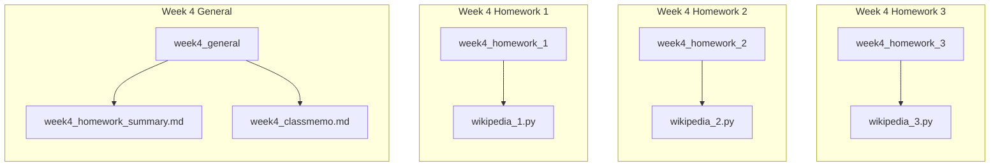

# Week4 Homework Summary
## 各レポジトリの構成

---
## Homework1

### 内容
* [データセットのフォーマット](https://docs.google.com/presentation/d/1m6uTcNhnmjky578GVXMbyOCu2-yM4lNqU8FR5eJdx_I/edit?slide=id.g1e13c1d4e24_1_507#slide=id.g1e13c1d4e24_1_507)
* あるページから別のページへの最短経路を出力する。
* find_shortest_path()関数を作成する。
* BFSを利用する。
### 提出コード

### 説明

---
## Homework2

### 内容
* ページランクを計算して重要度の高いページトップ10を出力する。
* ind_most_popular_pages() 関数を作成する。
* 時間計算量はO(N+E)。
* 正しさの確認方法: ページランクの分配と更新を何回繰り返しても、全ノードのページランクの合計値が一定に保たれることを確認
* 収束条件: ページランクの更新が完全に収束するのは時間がかかりすぎるので、更新が十分少なくなったら止める。例）∑(new_pagerank[i] - old_pagerank[i])^2 < 0.01

### 提出コード

### 説明

---
## Homework3

### 内容
* Wikipedia のグラフについて「渋谷」から「池袋」まで、同じページを重複して通らない、できるだけ長い経路を発見してください！！

### 提出コード

### 説明

## 今週の計画
* H

