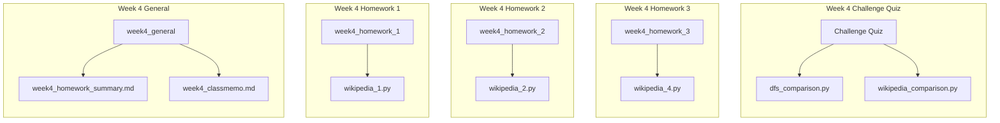

# Week4 Homework Summary
## 各レポジトリの構成


---
## Homework1

### 内容
* [データセットのフォーマット](https://docs.google.com/presentation/d/1m6uTcNhnmjky578GVXMbyOCu2-yM4lNqU8FR5eJdx_I/edit?slide=id.g1e13c1d4e24_1_507#slide=id.g1e13c1d4e24_1_507)
* あるページから別のページへの最短経路を出力する。
* find_shortest_path()関数を作成する。
* BFSを利用する。

### 提出コード
[wikipedia_1.py](https://github.com/nzhzxnk/STEP/blob/main/week4_homework_1/wikipedia_1.py)

### 説明
1. `def __init__(self, pages_file, links_file):`

* `self.titles`, `self.ids`, `self.links` という3つのdictionaryを作成。
* `self.titles`: pages_small/medium/large.txtファイルを読み込み、`{ id_1:title_1, id_2:title_2, ...}`という形で保存。
* `self.ids`: pages_small/medium/large.txtファイルを読み込み、`{ title_1:id_1, title_2:id_2, ...}`という形で保存。
* `self.links`: links_small/medium/large.txtファイルを読み込み、`{ id_1:[dst_id_1, dst_id_2], id_2:[], ...}`という形で保存。子リンクがないsource_idに対しても空リストを持っている。

2. `def find_shortest_path(self, start, goal):`

* start, goalはタイトル名で与えられるので、`self.ids`を用いてstart_id, goal_idに変換する。
* getメゾットを用いて、`self.ids`に与えられたタイトル名が含まれなければ`-1`を返す。
* さらに`assert start_id != -1, f"{start} is not found."`によって、与えられたタイトル名がデータセットになかった場合には`Assertion Error`となる。

* `visited`: すでに訪れたページのidを`(id_1, id_2, ...)`というsetの形で保存しておく。このコードではqueueに追加した際に、visitedにもidを追加する仕組みとした。
* `q`: 探索する予定のページのidとそのページに至るまでの経路リストを`[(id_1, [id_2, id_3, id_4]), (id_5, [id_6, id_7]), ...] `というdequeの形で保存しておく。appendで右側から追加、popleftで左側から取り出しすることで順序性を保つ仕組みとなっている。
* `shortest_routes`: 最短経路の候補を格納しておくリスト。`[[title_1, title_2, ...], [title_3, title_4, ...], ...]`という多重リストの形で保存しておく。
* `min_route_length`: 現在の最短経路の長さを保存しておく。これ以上長い経路は以降探索しないようにすることで、無駄な経路探索を減少させた。

* `q`からpopleftした要素を、`is_visiting_id`(int), `route_taken`(list) とする。
* `route_taken`がすでに`min_route_length`以上の経路は、それ以降探索しない。
* `is_visiting_id`からリンクされている`dst_id`の中で、`visited`に含まれていないものがあれば、そこに進んで経路探索する。
* `dst_id == goal_id`であった場合は、`len(new_route)`と`min_route_length`の条件によって実行が異なる。
* `len(new_route) > min_route_length`の場合は、その経路は最短経路でないので何もしない。
* `len(new_route) == min_route_length`の場合は、その経路は最短経路候補なので`shortest_routes`に追加する。
* `len(new_route) < min_route_length`の場合は、その経路は最短経路候補だが今までの`shortest_routes`は最短経路ではなくなる。`shortest_routes`と`min_route_length`を更新する。
* `shortest_routes`に追加する際には`shortest_routes = [[self.titles[id] for id in new_route]] `とし、idではなくtitleのリストとして追加する。
* `dst_id != goal_id`であった場合は、今後も経路探索を続ける必要があるため`q`に追加する。
* `start_id == goal_id`のような例外的な場合については別途対処する。

### 入力と出力結果
1. medium set, `wikipedia.find_shortest_path("渋谷", "小野妹子")`

the shortest path is: 渋谷 -> ギャルサー_(テレビドラマ) -> 小野妹子

2. large set, `wikipedia.find_shortest_path("渋谷", "小野妹子")`

the shortest path is: 渋谷 -> ギャルサー_(テレビドラマ) -> 小野妹子

3. medium set, `wikipedia.find_shortest_path("流体力学", "蒙古タンメン")`

the shortest path was not found.

4. large set, `wikipedia.find_shortest_path("流体力学", "蒙古タンメン")`

the shortest path is: 流体力学 -> 1653年 -> 6月23日 -> ななもり。 -> 蒙古タンメン

5. medium set, `wikipedia.find_shortest_path("文脈自由文法", "ユニクロ")`

the shortest path is: 文脈自由文法 -> 形式言語 -> 言語 -> 広辞苑 -> ユニクロ

the shortest path is: 文脈自由文法 -> 形式言語 -> 英語 -> Q -> ユニクロ

the shortest path is: 文脈自由文法 -> 形式言語 -> ISBN -> 流通 -> ユニクロ

the shortest path is: 文脈自由文法 -> 形式言語 -> プロパガンダ -> カイザー・ヴィルヘルム記念教会 -> ユニクロ

the shortest path is: 文脈自由文法 -> 形式言語 -> 修辞学 -> 早稲田大学 -> ユニクロ　、他40個

### 修正前コードの検討

* このコードに修正する前に書いたコードがあったが、これだと実行時間が非常に長すぎて使い物にならなかった。
* 無限ループなど機能的に誤りがあったのか、単に無駄な探索が多すぎたのか、少し検討したい

```python3 []
 while q:
            count += 1
            # print(count) #debag
            is_visiting_id, route_taken = q.popleft()
            visited.add(is_visiting_id) # Add is_visiting_id to visited.
            if not find_goal:
                if is_visiting_id == goal_id: # If reach the goal, return route taken.
                    find_goal = True
                    path = [self.titles[id] for id in route_taken]
                    shortest_path_length = len(path)
                    shortest_paths.append(path) # Change from a id to the title. <self.titles>
                else:
                    for dst_id in self.links[is_visiting_id]:  # Search for destinations of is_visiting_id.
                        if dst_id in visited: # Check for multiple visits. <visited>
                            continue
                        else: # If the destination was NOT visited, append dst_id,route_taken to queue. 
                            q.append((dst_id,route_taken+[dst_id])) # add dst_id to route_taken 
            else:
                if is_visiting_id == goal_id: # If reach the goal, return route taken.
                    if len([self.titles[id] for id in route_taken]) <= shortest_path_length:
                        shortest_paths.append([self.titles[id] for id in route_taken]) # Change from a id to the title. <self.titles>
        return shortest_paths
```
---
## Homework2

### 内容
* ページランクを計算して重要度の高いページトップ10を出力する。
* ind_most_popular_pages() 関数を作成する。
* 時間計算量はO(N+E)。
* 正しさの確認方法: ページランクの分配と更新を何回繰り返しても、全ノードのページランクの合計値が一定に保たれることを確認
* 収束条件: ページランクの更新が完全に収束するのは時間がかかりすぎるので、更新が十分少なくなったら止める。例）∑(new_pagerank[i] - old_pagerank[i])^2 < 0.01

### 提出コード
[wikipedia_2.py](https://github.com/nzhzxnk/STEP/blob/main/week4_homework_2/wikipedia_2.py)

### 説明

* `old_pagerank`: 新たな計算開始前のページidとpagerankを、`{id_1:1.0, id_2:1.0, ...}`という形で保存しておく。
* `converging`: pagerankの計算が収束していれば`True`、していなければ`False`とする。`converging == False`であれば計算を続ける。
* `num_pages`: 全体のページ数。また、pagerankの合計は常にこれと同じになる。

* `new_pagerank`: 新たな計算後のページidとpagerankを、`{id_1:1.0, id_2:1.0, ...}`という形で保存しておく。はじめは全て`0.0`に初期化しておく。
* `random_jump_value`: すべてのページに均等に振り分けられる分のpagerankの合計。
* `torerance`: 計算前後で生じた差の合計。各ページについての`(new_pagerank[id]-old_pagerank[id])**2 `の合計で表す。

* `self.links.items()`の各要素を`src_id`(親ページのid),`dst_ids`(子ページのidのlist)とする。
* `src_id`からリンクされた子ページがない場合、`old_pagerank[src_id]` を全て`random_jump_value`に加える。
* `src_id`からリンクされた子ページがある場合、`old_pagerank[src_id]*0.85`を子ページに均等に振り分ける。また`old_pagerank[src_id]*0.15`を`random_jump_value`に加える。
* 計算の最後に、`random_jump_page`をすべてのページに均等に振り分ける。
* `assert abs(sum(new_pagerank.values()) - num_pages) < 1e-4, f"the pagerank system is wrong.{sum(new_pagerank.values()) - num_pages} "`で、pagerankの合計が`num_pages`と等しくない場合はAssertion Errorを起こすようにした。
* mediumのデータセットで`AssertionError: the pagerank system is wrong.-1.0110670700669289e-06`というerrorが出たので、`1e-4`程度が妥当な基準と考えた。
* 浮動小数点や除算を含む計算であり、完全に一致するわけではないので、`sum(new_pagerank.values()) == num_pages`は用いなかった。
* `torerance < 0.01`となったら、`converging = True`として計算のループを抜ける。
* `top10_pagerank_ids`: 計算が終了したら`new_pagerank.items()`をpagerankに着目し降順に並べ、上から順に10番目までを切り出してリストにする。

### 出力結果
1. small set

the most important 10 pages are: 
C
D
B
E
F
A

2. medium set

the most important 10 pages are: 
英語
ISBN
2006年
2005年
2007年
東京都
昭和
2004年
2003年
2000年

3. large set
the most important 10 pages are: 
英語
日本
VIAF_(識別子)
バーチャル国際典拠ファイル
アメリカ合衆国
ISBN
ISNI_(識別子)
国際標準名称識別子
地理座標系
SUDOC_(識別子)


---
## Homework3

### 内容
* Wikipedia のグラフについて「渋谷」から「池袋」まで、同じページを重複して通らない、できるだけ長い経路を発見してください！！

### 提出コード
[wikipedia_4.py](https://github.com/nzhzxnk/STEP/blob/main/week4_homework_3/wikipedia_4.py)

### 説明
* 簡単な例で考えた時に、なるべく経路が長くなる時はstartページとgoalページからなるべく遠い中間地点を通っているということがわかり、BFSとwhileループを利用すればいいのではと思いついて書いてみました。
*
1. startページから任意のページまでの距離（コードでは`diatance_from_src`と定義しました。）と、goalページから任意のページまでの距離（コードでは`diatance_to_dst`と定義しました。）の合計が最も大きくなる任意のページを、なるべく遠い中間地点と定義します。
2. このときのstartページから任意のページまでの距離や、goalページから任意のページまでの距離はBFSで計算します。
3. 中間地点（コードでは`via_id`と定義しました。）が決まったら、今度はstartページと中間地点の間についても1の操作してなるべく離れた中間地点を見つけます。
4. これを2つのページ間の中間地点が見つからなくなるまで繰り返します。

### 問題点
* 大きな問題点としては、効率があまりにも悪い。
* 現時点で一つの中間地点を算出するのに平均10秒くらいかかるので、もし答えは最大631853個であるので146日間ずっと計算し続けないといけないという見積もりになった、、
* 効率を上げられる方法を考える。
* 全探索BFSを毎回やっているのがやっぱりボトルネックか。
* 全くBFS要らなくなるわけではないが、ある任意のページからの距離の辞書を永久的に保存しておく方が、計算時間は短くなるか。
* メモリの問題になってくる`631853*631853*2`なので現実的に全て保存も難しいか。
* `def find_node_with_max_total_distance`で`for page_id in self.titles:`としているのはやっぱり無駄な気がする。
* 例えば`page_ids = sorted(distance.items(), key=lambda item:item[1], reverse= True)`として`for page_id in page_ids:`にすれば少しは探索するもの減るか。
* 最後までループしないと完全な答え出せない。現在推定4000個。
---
## Challenge Quiz (Homework4)

### 内容
*　再帰版 DFS と同じたどり方をする DFS をスタックを使って書く。
* "A -> B -> C -> D -> E -> F" が最初に発見される DFS をスタックで書けたら合格
* 解法は何種類かある
* [参考スライド](https://docs.google.com/presentation/d/1m6uTcNhnmjky578GVXMbyOCu2-yM4lNqU8FR5eJdx_I/edit?slide=id.g230e6d63cfe_0_443#slide=id.g230e6d63cfe_0_443)

### 提出コード
[dfs_comparison.py](https://github.com/nzhzxnk/STEP/blob/main/week4_homework_4/dfs_comparison.py)

### 説明
* [Extra Case 4,5](https://docs.google.com/presentation/d/1y6KeTZW0D5j-zC5g9wzwbjEOnfqy5jf-CiVjIav-gjI/edit?slide=id.g3671df616ba_2_565#slide=id.g3671df616ba_2_565)

### DFSの比較
* [dfs_comparison](https://docs.google.com/presentation/d/1y6KeTZW0D5j-zC5g9wzwbjEOnfqy5jf-CiVjIav-gjI/edit?usp=sharing)
*　力尽きてしまったので、まだ作成途中。来週までにそれぞれのDFSのバリエーションや規則性について理解したい。

---
## PageRankについて (Homework4)
(pagerank_vs_connections)[https://github.com/nzhzxnk/STEP/blob/main/pagerank_vs_connections.png]

### 説明
* Homework3を解く時に、孤立しているぺージを排除しページへのつながりの多いページを選んだらよいかという案もあり、ページのつながりを数値化しようと考えた。
* 他ページへのつながりの多さを単純に、向いている矢印と外に出ていく矢印の数(`connection`)で判断するか`pagerank`で判断するか考えた。
* 孤立しているページの`pagerank`は少なくなり、向いている矢印の数が多く、より`pagerank`の高いページからリンクされていれば`pagerank`は高くなる。
* そもそもつながりの多いページが長い経路を取る説明ができずHomework3は別の方針を考えたが、せっかくなので`connection`と`pagerank`の相関関係について少し調べてみることにした。
* 基本的には一次関数的に近似できそうであった。
* しかし中には、繋がりがほぼ0にkも関わらずpagerankがかなり上位のページが何個かあった。
* このページについて、データ構造など確認したい！！時間ある時来週かな。

### コード
[wikipedia_comparison.py](https://github.com/nzhzxnk/STEP/blob/main/week4_homework_4/wikipedia_comparison.py)
