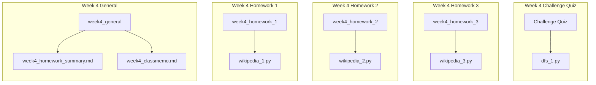

# Week4 Homework Summary
## 各レポジトリの構成


---
## Homework1

### 内容
* [データセットのフォーマット](https://docs.google.com/presentation/d/1m6uTcNhnmjky578GVXMbyOCu2-yM4lNqU8FR5eJdx_I/edit?slide=id.g1e13c1d4e24_1_507#slide=id.g1e13c1d4e24_1_507)
* あるページから別のページへの最短経路を出力する。
* find_shortest_path()関数を作成する。
* BFSを利用する。

### 提出コード
[wikipedia_1.py](https://github.com/nzhzxnk/STEP/blob/main/week4_homework_1/wikipedia_1.py)

### 説明
1. `def __init__(self, pages_file, links_file):`

* `self.titles`, `self.ids`, `self.links` という3つのdictionaryを作成。
* `self.titles`: pages_small/medium/large.txtファイルを読み込み、`{ id_1:title_1, id_2:title_2, ...}`という形で保存。
* `self.ids`: pages_small/medium/large.txtファイルを読み込み、`{ title_1:id_1, title_2:id_2, ...}`という形で保存。
* `self.links`: links_small/medium/large.txtファイルを読み込み、`{ id_1:[dst_id_1, dst_id_2], id_2:[], ...}`という形で保存。子リンクがないsource_idに対しても空リストを持っている。

2. `def find_shortest_path(self, start, goal):`

* start, goalはタイトル名で与えられるので、`self.ids`を用いてstart_id, goal_idに変換する。
* getメゾットを用いて、`self.ids`に与えられたタイトル名が含まれなければ`-1`を返す。
* さらに`assert start_id != -1, f"{start} is not found."`によって、与えられたタイトル名がデータセットになかった場合には`Assertion Error`となる。

* `visited`: すでに訪れたページのidを`(id_1, id_2, ...)`というsetの形で保存しておく。このコードではqueueに追加した際に、visitedにもidを追加する仕組みとした。
* `q`: 探索する予定のページのidとそのページに至るまでの経路リストを`[(id_1, [id_2, id_3, id_4]), (id_5, [id_6, id_7]), ...] `というdequeの形で保存しておく。appendで右側から追加、popleftで左側から取り出しすることで順序性を保つ仕組みとなっている。
* `shortest_routes`: 最短経路の候補を格納しておくリスト。`[[title_1, title_2, ...], [title_3, title_4, ...], ...]`という多重リストの形で保存しておく。
* `min_route_length`: 現在の最短経路の長さを保存しておく。これ以上長い経路は以降探索しないようにすることで、無駄な経路探索を減少させた。

* `q`からpopleftした要素を、`is_visiting_id`(int), `route_taken`(list) とする。
* `route_taken`がすでに`min_route_length`以上の経路は、それ以降探索しない。
* `is_visiting_id`からリンクされている`dst_id`の中で、`visited`に含まれていないものがあれば、そこに進んで経路探索する。
* `dst_id == goal_id`であった場合は、`len(new_route)`と`min_route_length`の条件によって実行が異なる。
* `len(new_route) > min_route_length`の場合は、その経路は最短経路でないので何もしない。
* `len(new_route) == min_route_length`の場合は、その経路は最短経路候補なので`shortest_routes`に追加する。
* `len(new_route) < min_route_length`の場合は、その経路は最短経路候補だが今までの`shortest_routes`は最短経路ではなくなる。`shortest_routes`と`min_route_length`を更新する。
* `shortest_routes`に追加する際には`shortest_routes = [[self.titles[id] for id in new_route]] `とし、idではなくtitleのリストとして追加する。
* `dst_id != goal_id`であった場合は、今後も経路探索を続ける必要があるため`q`に追加する。
* `start_id == goal_id`のような例外的な場合については別途対処する。

### 入力と出力結果
1. medium set, `wikipedia.find_shortest_path("渋谷", "小野妹子")`

the shortest path is: 渋谷 -> ギャルサー_(テレビドラマ) -> 小野妹子

2. large set, `wikipedia.find_shortest_path("渋谷", "小野妹子")`

the shortest path is: 渋谷 -> ギャルサー_(テレビドラマ) -> 小野妹子

3. medium set, `wikipedia.find_shortest_path("流体力学", "蒙古タンメン")`

the shortest path was not found.

4. large set, `wikipedia.find_shortest_path("流体力学", "蒙古タンメン")`

the shortest path is: 流体力学 -> 1653年 -> 6月23日 -> ななもり。 -> 蒙古タンメン

5. medium set, `wikipedia.find_shortest_path("文脈自由文法", "ユニクロ")`

the shortest path is: 文脈自由文法 -> 形式言語 -> 言語 -> 広辞苑 -> ユニクロ

the shortest path is: 文脈自由文法 -> 形式言語 -> 英語 -> Q -> ユニクロ

the shortest path is: 文脈自由文法 -> 形式言語 -> ISBN -> 流通 -> ユニクロ

the shortest path is: 文脈自由文法 -> 形式言語 -> プロパガンダ -> カイザー・ヴィルヘルム記念教会 -> ユニクロ

the shortest path is: 文脈自由文法 -> 形式言語 -> 修辞学 -> 早稲田大学 -> ユニクロ

the shortest path is: 文脈自由文法 -> プログラミング言語 -> 日本語 -> 日本の経済 -> ユニクロ

the shortest path is: 文脈自由文法 -> プログラミング言語 -> 日本語 -> 日本の百貨店 -> ユニクロ

the shortest path is: 文脈自由文法 -> プログラミング言語 -> 1980年代 -> キース・ヘリング -> ユニクロ

the shortest path is: 文脈自由文法 -> プログラミング言語 -> Ruby -> 松江市 -> ユニクロ

the shortest path is: 文脈自由文法 -> プログラミング言語 -> 1950年代 -> カンボジア -> ユニクロ

the shortest path is: 文脈自由文法 -> プログラミング言語 -> 人間 -> 養老孟司 -> ユニクロ

the shortest path is: 文脈自由文法 -> プログラミング言語 -> ユビキタスコンピューティング -> RFID -> ユニクロ

the shortest path is: 文脈自由文法 -> プログラミング言語 -> 電子投票 -> 広島県 -> ユニクロ

the shortest path is: 文脈自由文法 -> ノーム・チョムスキー -> 1988年 -> 6月19日 -> ユニクロ

the shortest path is: 文脈自由文法 -> ノーム・チョムスキー -> 1988年 -> 内田篤人 -> ユニクロ

the shortest path is: 文脈自由文法 -> ノーム・チョムスキー -> 2001年 -> 新宿区 -> ユニクロ

the shortest path is: 文脈自由文法 -> ノーム・チョムスキー -> 1996年 -> トムス・エンタテインメント -> ユニクロ

the shortest path is: 文脈自由文法 -> ノーム・チョムスキー -> 1996年 -> 三吉彩花 -> ユニクロ

the shortest path is: 文脈自由文法 -> ノーム・チョムスキー -> 1999年 -> ジョジョの奇妙な冒険 -> ユニクロ

the shortest path is: 文脈自由文法 -> ノーム・チョムスキー -> 1999年 -> 吉良吉影 -> ユニクロ

the shortest path is: 文脈自由文法 -> ノーム・チョムスキー -> 国際連合 -> グラミン銀行 -> ユニクロ

the shortest path is: 文脈自由文法 -> ノーム・チョムスキー -> 1928年 -> 平良とみ -> ユニクロ

the shortest path is: 文脈自由文法 -> ノーム・チョムスキー -> 1928年 -> しんぶん赤旗 -> ユニクロ

the shortest path is: 文脈自由文法 -> ノーム・チョムスキー -> 政治 -> 障害者 -> ユニクロ

the shortest path is: 文脈自由文法 -> ノーム・チョムスキー -> ソビエト連邦 -> ジーンズ -> ユニクロ

the shortest path is: 文脈自由文法 -> ノーム・チョムスキー -> アメリカ同時多発テロ事件 -> 日経平均株価 -> ユニクロ

the shortest path is: 文脈自由文法 -> ノーム・チョムスキー -> 大学院 -> 帝京平成大学 -> ユニクロ

the shortest path is: 文脈自由文法 -> ノーム・チョムスキー -> 12月7日 -> 宮本笑里 -> ユニクロ

the shortest path is: 文脈自由文法 -> ノーム・チョムスキー -> マサチューセッツ工科大学 -> キリンホールディングス -> ユニクロ

the shortest path is: 文脈自由文法 -> ノーム・チョムスキー -> 講談社 -> セミヌード -> ユニクロ

the shortest path is: 文脈自由文法 -> ノーム・チョムスキー -> マスメディア -> 姫路駅 -> ユニクロ

the shortest path is: 文脈自由文法 -> ノーム・チョムスキー -> ベトナム戦争 -> 水木しげる -> ユニクロ

the shortest path is: 文脈自由文法 -> ノーム・チョムスキー -> 労働者 -> 非正規雇用 -> ユニクロ

the shortest path is: 文脈自由文法 -> ノーム・チョムスキー -> 労働者 -> 変形労働時間制 -> ユニクロ

the shortest path is: 文脈自由文法 -> ノーム・チョムスキー -> ジェレミ・ベンサム -> 毛皮 -> ユニクロ

the shortest path is: 文脈自由文法 -> ノーム・チョムスキー -> 鶴見俊輔 -> 福島瑞穂 -> ユニクロ

the shortest path is: 文脈自由文法 -> ノーム・チョムスキー -> カリフォルニア大学バークレー校 -> 竹内弘高 -> ユニクロ

the shortest path is: 文脈自由文法 -> ノーム・チョムスキー -> カリフォルニア大学バークレー校 -> 明治大学 -> ユニクロ

the shortest path is: 文脈自由文法 -> ノーム・チョムスキー -> コロンビア大学 -> 松任谷由実 -> ユニクロ

the shortest path is: 文脈自由文法 -> ノーム・チョムスキー -> 文藝春秋 -> 週刊文春 -> ユニクロ

the shortest path is: 文脈自由文法 -> ノーム・チョムスキー -> みすず書房 -> 池田香代子 -> ユニクロ

the shortest path is: 文脈自由文法 -> ノーム・チョムスキー -> ニューヨーク -> 多国籍企業 -> ユニクロ

the shortest path is: 文脈自由文法 -> ノーム・チョムスキー -> 研究社 -> 吉祥寺 -> ユニクロ

the shortest path is: 文脈自由文法 -> ノーム・チョムスキー -> いいだもも -> 水戸市 -> ユニクロ

the shortest path is: 文脈自由文法 -> 生成文法 -> 1965年 -> リポビタンD -> ユニクロ

the shortest path is: 文脈自由文法 -> 生成文法 -> 1965年 -> 小林靖子 -> ユニクロ

the shortest path is: 文脈自由文法 -> 生成文法 -> 1965年 -> 野村万蔵_(9世) -> ユニクロ

the shortest path is: 文脈自由文法 -> アルゴリズム -> 著作権 -> 多摩市 -> ユニクロ

the shortest path is: 文脈自由文法 -> アルゴリズム -> ハッシュ関数 -> スーパーマーケット -> ユニクロ

the shortest path is: 文脈自由文法 -> ALGOL -> 1958年 -> 日本コカ・コーラ -> ユニクロ

the shortest path is: 文脈自由文法 -> ALGOL -> 1958年 -> 桃屋 -> ユニクロ

the shortest path is: 文脈自由文法 -> ALGOL -> 9月1日 -> 八王子市 -> ユニクロ

the shortest path is: 文脈自由文法 -> ALGOL -> 9月1日 -> 羽生市 -> ユニクロ

the shortest path is: 文脈自由文法 -> ALGOL -> ケース・ウェスタン・リザーブ大学 -> ファーストリテイリング -> ユニクロ

the shortest path is: 文脈自由文法 -> ALGOL -> ケース・ウェスタン・リザーブ大学 -> ロッテホールディングス -> ユニクロ

the shortest path is: 文脈自由文法 -> パーニニ -> ヒンドゥー教 -> 禅宗 -> ユニクロ

the shortest path is: 文脈自由文法 -> パーニニ -> ダルマ -> 小田原市 -> ユニクロ

the shortest path is: 文脈自由文法 -> タミル語 -> 大野晋 -> 江東区 -> ユニクロ

the shortest path is: 文脈自由文法 -> タミル語 -> チェンナイ -> 現代自動車 -> ユニクロ

the shortest path is: 文脈自由文法 -> タミル語 -> 都市伝説 -> ロッテリア -> ユニクロ

the shortest path is: 文脈自由文法 -> バッカス・ナウア記法 -> 1959年 -> 田口ランディ -> ユニクロ

the shortest path is: 文脈自由文法 -> バッカス・ナウア記法 -> 姓 -> 山口県 -> ユニクロ

the shortest path is: 文脈自由文法 -> バッカス・ナウア記法 -> 姓 -> 小平市 -> ユニクロ

the shortest path is: 文脈自由文法 -> タプル -> 数詞 -> 渋谷 -> ユニクロ

the shortest path is: 文脈自由文法 -> 理論計算機科学 -> 1931年 -> 津田沼 -> ユニクロ

the shortest path is: 文脈自由文法 -> 理論計算機科学 -> 1948年 -> ロッテ -> ユニクロ

the shortest path is: 文脈自由文法 -> 理論計算機科学 -> 1948年 -> 糸井重里 -> ユニクロ

the shortest path is: 文脈自由文法 -> 理論計算機科学 -> 1948年 -> 重光武雄 -> ユニクロ

the shortest path is: 文脈自由文法 -> スイスドイツ語 -> スイス -> ロジャー・フェデラー -> ユニクロ

the shortest path is: 文脈自由文法 -> 畳語 -> 愛称 -> サッカー日本女子代表 -> ユニクロ

### 修正前コードの検討

* このコードに修正する前に書いたコードがあったが、これだと実行時間が非常に長すぎて使い物にならなかった。
* 無限ループなど機能的に誤りがあったのか、単に無駄な探索が多すぎたのか、少し検討したい

```python3 []
 while q:
            count += 1
            # print(count) #debag
            is_visiting_id, route_taken = q.popleft()
            visited.add(is_visiting_id) # Add is_visiting_id to visited.
            if not find_goal:
                if is_visiting_id == goal_id: # If reach the goal, return route taken.
                    find_goal = True
                    path = [self.titles[id] for id in route_taken]
                    shortest_path_length = len(path)
                    shortest_paths.append(path) # Change from a id to the title. <self.titles>
                else:
                    for dst_id in self.links[is_visiting_id]:  # Search for destinations of is_visiting_id.
                        if dst_id in visited: # Check for multiple visits. <visited>
                            continue
                        else: # If the destination was NOT visited, append dst_id,route_taken to queue. 
                            q.append((dst_id,route_taken+[dst_id])) # add dst_id to route_taken 
            else:
                if is_visiting_id == goal_id: # If reach the goal, return route taken.
                    if len([self.titles[id] for id in route_taken]) <= shortest_path_length:
                        shortest_paths.append([self.titles[id] for id in route_taken]) # Change from a id to the title. <self.titles>
        return shortest_paths
```
---
## Homework2

### 内容
* ページランクを計算して重要度の高いページトップ10を出力する。
* ind_most_popular_pages() 関数を作成する。
* 時間計算量はO(N+E)。
* 正しさの確認方法: ページランクの分配と更新を何回繰り返しても、全ノードのページランクの合計値が一定に保たれることを確認
* 収束条件: ページランクの更新が完全に収束するのは時間がかかりすぎるので、更新が十分少なくなったら止める。例）∑(new_pagerank[i] - old_pagerank[i])^2 < 0.01

### 提出コード
[wikipedia_2.py](https://github.com/nzhzxnk/STEP/blob/main/week4_homework_2/wikipedia_2.py)

### 説明

* `old_pagerank`: 新たな計算開始前のページidとpagerankを、`{id_1:1.0, id_2:1.0, ...}`という形で保存しておく。
* `converging`: pagerankの計算が収束していれば`True`、していなければ`False`とする。`converging == False`であれば計算を続ける。
* `num_pages`: 全体のページ数。また、pagerankの合計は常にこれと同じになる。

* `new_pagerank`: 新たな計算後のページidとpagerankを、`{id_1:1.0, id_2:1.0, ...}`という形で保存しておく。はじめは全て`0.0`に初期化しておく。
* `random_jump_value`: すべてのページに均等に振り分けられる分のpagerankの合計。
* `torerance`: 計算前後で生じた差の合計。各ページについての`(new_pagerank[id]-old_pagerank[id])**2 `の合計で表す。

* `self.links.items()`の各要素を`src_id`(親ページのid),`dst_ids`(子ページのidのlist)とする。
* `src_id`からリンクされた子ページがない場合、`old_pagerank[src_id]` を全て`random_jump_value`に加える。
* `src_id`からリンクされた子ページがある場合、`old_pagerank[src_id]*0.85`を子ページに均等に振り分ける。また`old_pagerank[src_id]*0.15`を`random_jump_value`に加える。
* 計算の最後に、`random_jump_page`をすべてのページに均等に振り分ける。
* `assert abs(sum(new_pagerank.values()) - num_pages) < 1e-4, f"the pagerank system is wrong.{sum(new_pagerank.values()) - num_pages} "`で、pagerankの合計が`num_pages`と等しくない場合はAssertion Errorを起こすようにした。
* mediumのデータセットで`AssertionError: the pagerank system is wrong.-1.0110670700669289e-06`というerrorが出たので、`1e-4`程度が妥当な基準と考えた。
* 浮動小数点や除算を含む計算であり、完全に一致するわけではないので、`sum(new_pagerank.values()) == num_pages`は用いなかった。
* `torerance < 0.01`となったら、`converging = True`として計算のループを抜ける。
* `top10_pagerank_ids`: 計算が終了したら`new_pagerank.items()`をpagerankに着目し降順に並べ、上から順に10番目までを切り出してリストにする。

### 出力結果
1. small set

the most important 10 pages are: 
C
D
B
E
F
A

2. medium set

the most important 10 pages are: 
英語
ISBN
2006年
2005年
2007年
東京都
昭和
2004年
2003年
2000年

3. large set
the most important 10 pages are: 
英語
日本
VIAF_(識別子)
バーチャル国際典拠ファイル
アメリカ合衆国
ISBN
ISNI_(識別子)
国際標準名称識別子
地理座標系
SUDOC_(識別子)


---
## Homework3

### 内容
* Wikipedia のグラフについて「渋谷」から「池袋」まで、同じページを重複して通らない、できるだけ長い経路を発見してください！！

### 提出コード
[wikipedia_4.py](https://github.com/nzhzxnk/STEP/blob/main/week4_homework_3/wikipedia_4.py)

### 説明
* 簡単な例で考えた時に、なるべく経路が長くなる時はstartページとgoalページからなるべく遠い中間地点を通っているということがわかり、BFSとwhileループを利用すればいいのではと思いついて書いてみました。今少し時間がないので、詳しい説明やコードの修正は夜にします。ごめんなさい。

1. startページから任意のページまでの距離（コードでは`diatance_from_src`と定義しました。）と、goalページから任意のページまでの距離（コードでは`diatance_to_dst`と定義しました。）の合計が最も大きくなる任意のページを、なるべく遠い中間地点と定義します。
2. このときのstartページから任意のページまでの距離や、goalページから任意のページまでの距離はBFSで計算します。
3. 中間地点（コードでは`via_id`と定義しました。）が決まったら、今度はstartページと中間地点の間についても1の操作してなるべく離れた中間地点を見つけます。
4. これを2つのページ間の中間地点が見つからなくなるまで繰り返します。

* 大きな問題点としては、効率があまりにも悪い点があります。現時点で一つの中間地点を算出するのに平均10秒くらいかかるので、もし答えが370000個近くとなると130日程計算し続けないといけない計算になってしました。。効率を上げられる方法があれば、どなたかご教示いただけますと嬉しいです。

* 1時間くらい回し続けていて、現時点で640個程度の経路になっています。
* 最後までループしないと完全な答え出せないのですが、このような感じです。
* 渋谷 -> IEコンポーネント -> ムーサル運動 -> カミナリ竜 -> IRC -> 塩化パラジウム -> 3D格闘ゲーム -> 兵庫県道337号塩瀬門戸荘線 -> 21トリソミー -> コンチネンタルIII -> 星型化 -> 東京最新版 -> 近鉄5000系電車 -> メタモナーダ門 -> BTB -> 鳥料理 -> Xinlisupreme -> PTF -> 宇宙麻雀 -> シエラレオネ共和国国旗 -> 子宮粘液症 -> OOP -> ロスレス圧縮 -> 土安 -> ブリルアンゾーン -> コンピュータの壁紙 -> 高校入試速報 -> フライオン・タスク -> グアニジニウム -> 完全ハズレ -> PCCTS -> 南日本ニコス -> クリソラミナラン -> QOS -> ナータン・ベン＝イェキエル -> XLRコネクター -> サンドロ・ペルティーニ -> Knight_Online -> Home_Office -> ハーフズ・ハック・パシャ -> PKK -> 観光タクシー_(鳥取県) -> 構文解析木 -> M2系 -> リガトゥーラ -> オルメス -> マルチパラダイム -> ケーパー -> ジオット_(画家) -> 共振現象 -> 延煕 -> VTE -> レックリングハウゼン病 -> 魚ポコDX -> QGP -> 同軸デジタル端子 -> ロドリーゴ -> Nop -> クオラム・センシング -> 魚ポコ2_今度は対戦ニャ! -> アメリカン・ジョーク -> ソニーコミュニケーションネットワーク -> ハイン-アバレンコフの擬ポテンシャル -> DS9 -> ヘンリー・W・テイト -> メインルーチン -> 藤八拳 -> アシスタントプロフェッサー -> OMT -> カール・アウグスト -> IGY -> 衝田岡 -> 裏移り -> ナホトカ号 -> Cavalier-Smith -> IFC -> 多元数理科学研究科 -> アランテ -> スタジオ・ランタイム -> NMO -> 八十種好 -> FM_Mle1915軽機関銃 -> OGM -> 1934型駆逐艦 -> ECO -> 国王任命インド人士官 -> アルキメデスの螺旋 -> アップフロントエージェンシーグループ -> メルヴィル湖 -> 相互コンダクタンス -> パーフェクトワールド-完美世界- -> ヨンシェーピン県 -> エルダール共通語 -> スモールワールド現象 -> ギュー -> ワラッターSUPER -> ピエール・ブーシェ -> カイツブリ科_(Sibley) -> Terapad -> カナビスカップ -> UMM -> LMTO -> キース・バン・ホーン -> Van_der_pol振動子 -> エレオノーレ -> VVI -> メディ倫 -> 入園 -> ガンダリウム -> デイビー造船所 -> BNF記法 -> 爆着 -> Yum -> クイーン_(駒) -> カマイタチ -> ギュスターヴ -> NEAT -> HKU -> NNI -> 山形ニコス -> 戴氏六合心意拳 -> GP7000Dシリーズ -> ニート_(曖昧さ回避) -> ジェイムズ -> 山ノ内駅 -> Astro -> アキラ_(改宗者) -> 葉の形 -> Azur -> 小カト -> ロイヤル・オンタリオ博物館 -> ブッドレヤ -> ALU -> 林崎重信 -> ANP -> ダイバージェンス -> Noncoding_DNA -> かに味噌 -> カルマン -> 戦女神2 -> JPL -> 損傷修復 -> 山内豊煕 -> GSS -> ピョートル・イリイチ・チャイコフスキー -> 筒子 -> PATH -> ムサール運動 -> 1,2-ジアミノエタン -> 雪の峠 -> WFQ -> ヴォイド -> 組織適合性抗原 -> PTL -> クレメンス1世 -> Ashcroftの擬ポテンシャル -> 増谷薬品 -> 分音符号 -> 刹奈紫之 -> 条件変数 -> 南詔国 -> 逆格子 -> マジックスネーク -> アルフレード・ドレフュス -> 6800 -> トキちゃんの今日もいい朝!はじまるよ!! -> イシドール・トラウズル -> 索子 -> 桂剥き -> ベッコウ -> Windows_ME -> 就職総合研究所 -> DRB -> 独立集合問題 -> 弟橘姫命 -> マヘル・シャラル・ハシュ・バズ -> 九品中正 -> ヴァドダラ -> SKC -> アビケブロン -> Pilot_Controlled_Lighting -> 趙光義 -> ランギロア島 -> EMACS -> 利己的遺伝要素 -> 理牌 -> ワサビダイコン -> スカラー行列 -> オゴタイ・ハーン -> ツインデトネーター -> ペタレ区 -> BVE -> 腎尿細管性アシドーシス -> マグ -> オーギュスタン・コーシー -> ホーキンズ -> Non-coding_RNA -> サスカッチュワン州 -> 大唐騎士 -> コーシーの定理 -> 内力 -> 小川町駅 -> 最小対立 -> サーメ語 -> みるく -> NDI -> マファルダ・カポネ -> WBF -> デビッド・マークソン -> SHH -> ラーマーティボーディ勲章 -> PDH -> FEAR -> 三角関数の加法定理 -> 検圧銃 -> CD-TEXT_PLAYER -> 送りつけ商法 -> ペイントブラシ -> ミトナグディーム -> クルーゾン症候群 -> テュルフィング -> 草津リトルシニア -> 元雑劇 -> ポワンカレ -> OPD -> 還元電位 -> オンラインレーベル -> エヴァンデル・スノ -> XMI -> ナリット親王 -> ジャージーデビル -> 洗牌 -> 活性水素 -> 人山人海 -> オキ -> IALA -> オーレ -> 支持塩 -> 萬子 -> 鉾田線 -> 青森ニコス -> 緑内障の分類 -> 1ゲーム連 -> リンカーン大聖堂 -> PBM -> エピジェネティックス -> YKKサッカー部 -> シラクサ県 -> 半田ごて -> フラーケン大佐 -> 固定バンドモデル -> ウリ専 -> 欧州連合条約 -> 波長分割多重 -> クウェンディ -> スパイウェア対策ソフト -> ねんざ -> FCX -> 優先キューイング -> コーラ属 -> SFD -> コラノキ -> TNO -> ミカド -> カエサル暗号 -> ステープラ -> Beautiful_Intensions -> LFX -> クラスタ解析 -> ギオルゴス・セイタリディス -> EUB -> エドワード・リー・ソーンダイク -> DTF -> クベラゲルジ -> PUI -> トルステン・フリングス -> VMX -> ウィリアム・シュテルン -> FIN -> 天体ショー -> 暫住制度 -> TVH -> エコール・ノルマル -> ワンポット -> RGK -> ダイア -> ガリレイの相対性原理 -> 放射線同位元素等による放射線障害の防止に関する法律 -> アニタ・ジュリアン -> パラクレゾール -> HPN -> N88BASIC -> ムリファイン -> AJPA -> クルマ -> 日本ブリーダー協会 -> Sanctuary_Records -> 解_(数学) -> YAMAMORIラジオ!! -> デデキント -> ゴクラクチョウカ -> 中国地区高専コンピュータクラブコミュニティ -> ニトバルデン州 -> トゥーリン・トゥランバール -> 小川薬品 -> CNV -> フォルゴーレ級駆逐艦 -> Service_Component_Architecture -> 首都地区 -> しずおか国際園芸博覧会 -> 三信鉄道デ1形電車 -> 岐阜ニコス -> 熱伝導の法則 -> 張國榮 -> 禁反言 -> SE-B -> 極限値 -> カムナン -> 伊川谷インターチェンジ -> デビ -> 共鳴安定化 -> サミット郡 -> XGI -> カール・ベォーレット -> IWW -> チャオプラヤー・ウィッチャイェーン -> キュリー_(単位) -> パチュン -> マラー -> オンライン・ジャーナル -> ヴィクトリア・ランド -> Unified_Modeling_Language -> ニジニノブゴロド -> IBT -> 既経過保険料 -> ホウライショウ属 -> FDB -> レイシオ・デシデンダイ -> ギア・ギア -> ロイカート・ヴァラッハ反応 -> VGR -> ガウス基底 -> ヨーロッパ半島 -> 偽善者 -> ガルマンウルフ -> コート・ドール -> JOB -> ルチジン -> かすり傷 -> プロテインチロシンキナーゼ -> 白魔法 -> オープン・ユア・アイズ_(雑誌) -> ガウシアンブロードニング法 -> ガスパル・ヴァン・ウェールベケ -> EOQ -> 嚢胞性膀胱炎 -> 貧歯目 -> 雍煕 -> ニューヘブン_(コネチカット州) -> スージー・ベリル -> VZV -> キング_(駒) -> ケナシサダソウ -> 徳光の情報スピリッツ -> 昇降機賠償責任保険 -> OBU -> ISAM -> スピン_(物理) -> 中切歯 -> Bangkok_Modern_Terminal -> 可算加法族 -> 第二大臼歯 -> YIQ -> 通学班 -> 大井川鉄道3000系電車_(初代) -> 教皇無謬説 -> KING'S_FIELD -> バルツ・シーマン反応 -> RVH -> 2006年の映画/8月 -> VOY -> 紫外可視吸収スペクトル -> エイプ -> ラヘル・フォン・ファルンハーゲン -> 腺性膀胱炎 -> オレスティア三部作 -> 真田澪 -> チェンマイ王朝 -> 絶縁の種類 -> 青山_(曖昧さ回避) -> コクセター図形 -> レセルカーダ -> 国鉄キハ03形気動車 -> ホーガンズ・アレイ -> パオ -> クラウジウスの原理 -> プーヤイバーン -> ラス・フリーマン -> NRP -> MAX_PAYNE -> 小犬座 -> モーペルテュイの原理 -> 山本郁子_(ミュージシャン) -> ブルン細胞巣 -> はじめてのおつきあい -> 札幌市交通局Tc1形電車 -> 女王対スパロー -> 京都検定 -> ブラック・パンサー -> カル -> アミノアシルtRNAシンテターゼ -> RIU -> アゲ -> EPRのパラドックス -> ママドゥ・ラミン・ルーム -> プラ・ルワン -> KKR-CPA -> エントロピー増大の原理 -> 幕末浪漫第二幕_月華の剣士 -> ノルム保存擬ポテンシャル -> グッリェルモ -> いつも心に太陽新聞 -> リュウ -> アレキサンダー多項式 -> ファルマリ -> 南米国家共同体 -> 移動しない局 -> カタリーナ・プリングスハイム -> 木本昌造 -> 国鉄ワフ20000形貨車 -> ピエール＝フランソワ・ラスネール -> 擬波動関数 -> 大阪府道751号木ノ本岬線 -> シュテファン・シュライエルマッハー -> こつえー -> フン -> クロスマッチ -> ストレンゲージ -> Asp -> バンショワ -> ホールスラスター -> 師尾薬房 -> バッファ管理 -> JA京都にのくに -> ジェンダーロール -> チャルダッシュ -> 観音竹 -> MSB -> プロカス -> A_List_Apart -> 制御材 -> 支店経済 -> カリキュレイテッド・レイティング・アクセス・タスク -> マルキーニョス -> ポイ -> マキシマム・ディスタンス・ダブルドロップ -> ダリウス3世 -> NME誌 -> 田川小学校 -> 楊恭如 -> ラプラスの演算子 -> Lina -> 加加速度 -> たま -> つくば -> メヒルタ -> WXG -> コーヤンブットゥール・ポッラーッチ線 -> メキシコ・シティー・ベニート・フアレス国際空港 -> ナヴィエ＝ストークス方程式 -> ガンダムシリーズ登場兵器一覧 -> ミニマム・ディスタンス・ダブル・ドロップ -> リー・ヤーポン -> Cpp -> フンボルト兄弟 -> 少年マガジンスペシャル -> 組織再生誘導法 -> Cyc -> ロック郡 -> マキシマム・ディスタンス -> ヌオーロ -> フアン1世 -> ミニマム・ディスタンス -> 極限構造式 -> ハサン・イッゼト・パシャ -> TrueTypeフォント -> ティンバル -> パラメタ -> 牟礼_(防府市) -> ローフォースローフリクション装置 -> セルフライゲーティングブラケット -> マーズ・グローバル・サーヴェイヤー -> ANAスーパーフライヤーズカード -> 国鉄B1形蒸気機関車 -> 株主資本比率 -> 五燈會元 -> 社団法人BSデジタル放送推進協会 -> 国鉄F1形蒸気機関車 -> 片桐烈火 -> モンセラット・ブスタマンテ -> ルジャンドルの多項式 -> フアン2世 -> フライイン・タスク -> 銀河_(数学) -> フアン3世 -> トレインビジョン -> 大唾液腺 -> フィット -> ヘロット -> UMN -> 8900系 -> LRU -> 山田仙寿堂 -> アンドレアス・グラッセル -> 国鉄A1形蒸気機関車 -> コクセター行列 -> ジタ -> レオポルド1世 -> グラウンドプレーンアンテナ -> シメオン・ベン・ヨハイ -> 対数尤度比 -> Mozilla_Firefox_2 -> オカッパ -> 国鉄E1形蒸気機関車 -> 碰 -> トサフィスト -> デヴィ -> EJB -> ENYA -> 部分内殻補正 -> ベンポスタ -> ジャッジ・デクレアド・ゴール -> 米国数学会 -> 理想空燃比 -> 頭跳ね -> モーズリー -> YPP_(商標) -> フルベ族 -> ヌムリテス -> ウィザーズ・ヒム_(バンド) -> 国鉄D1形蒸気機関車 -> 下顎張反射 -> Leu -> 高母音 -> ニコライ・Y・デミヤノフ -> フリーソフトウエア -> プラヤー・ラッサダー -> RUP -> 養子説 -> VLB -> アルキタス_(クレーター) -> 酢酸オルセイン染色法 -> MUA -> 承諾殺人 -> RLE -> ビザン薬品 -> 動く -> プーリァ州 -> ボーロマラーチャー -> O/Rマッピング -> 兵庫県道122号久美浜気比線 -> 習熟曲線 -> ヌメノール -> レ・プレリュード -> IKF -> オイラーのトーティエント関数 -> 付加脱離 -> TDJ -> チェーターティラート親王 -> 電源コンセント -> キャンサー -> デルレイ -> HTTPサーバ -> ADコンバータ -> オーバーランド -> ヘア・アンド・ハウンド -> ラブレース_(クレーター) -> ハブ -> ヨートファー親王 -> タウ -> キャンキャン -> ヘジテーション・ワルツ -> シルベスター_(クレーター) -> ラウレル -> 殉爆試験 -> 第一共和国 -> 局所密度近似を越える試み -> ドラ -> デー -> 古喜里講 -> スペインの自治州一覧 -> CNG -> パイロット・デクレアド・ゴール -> マルキーニョ -> ユニタリ演算子 -> タイデグリー司祭 -> ゲシュタルト・セラピー -> CVM -> フォード_F-350_ハイリフト -> 線形従属 -> フリードリヒ・フォン・フロトー -> コンパクトシティー -> クン・ウォーラウォンサーティラート -> ひまつぶし -> FDM -> いぬ_(曖昧さ回避) -> ハバシゴシキドリ上科 -> SAX -> SNPs -> OCV -> 1対1対応 -> お漏らし -> エドワード・ゲイン -> 劉弗陵 -> 關錦鵬 -> 浜北上下水道事務所 -> 1号機関車 -> ルーヴァンカトリック大学 -> サイチョウ類 -> MBD -> 練業坤 -> VBE -> セウイ -> 黄文金 -> MARVEL_VS._CAPCOM -> 生天目章 -> Tenkara-mail_Special -> ビゾン_(駆逐艦) -> 仙台ライブドアフェニックス -> 東武5050系電車 -> アフォンソ1世 -> ストレートワイヤー法 -> マンデルブロー集合 -> ポワンソ_(クレーター) -> 2007年の映画/1月 -> 可換法則 -> サウス・オーストラリア -> 潮田三国堂 -> ドゥネダイン -> ユリ綱 -> RIE -> アブドゥル・クトゥーブ・シャー -> フィニステール -> 大阪夏の陣 -> 新京成8000形電車 -> アフォンソ4世 -> ラオ航空 -> 端懿 -> 自己無撞着 -> 日生薬品 -> 門前清模和 -> 極性反転 -> フリードリヒ・オットー・ショット -> アマルガムの機動兵器 -> 国鉄C1形蒸気機関車 -> そんぽ24 -> JIS保護等級 -> Minamo -> 多項式時間アルゴリズム -> 遠州鉄道西鹿島線 -> 字句要素 -> 2006年の映画/7月 -> ブロッキング_(紙) -> ウェブ日記 -> ギスパクローツ -> 室山真理子 -> 2,6-ジメチルピリジン -> スクールサクセス15 -> 団体長期障害所得補償保険 -> ラクスギーク -> ホアン・ミロ -> 後向き推論 -> フリードリヒ・フォン・ハルデンベルク -> ダブルブレイズ -> 射影子 -> 室山真弓 -> アフォンソ2世 -> クラスベース・キューイング -> フェルディナンド1世_(トスカーナ大公) -> 尿中尿素窒素 -> 汜水関 -> フーン -> 永和薬品商会_(東京都) -> 推計学 -> キッツムケイラム -> NMTO -> テトラミド -> ギスプドワダ -> 2007年の映画/2月 -> ソメリン -> ラ・チカ・デ・ロホ -> 2006年の映画/6月 -> シムオーン・バル・ヨーハイ -> ゴットマン -> 非輪状決定性有限オートマトン -> ガナーダ -> ファーストネイション -> 2院制 -> 2007年の映画/3月 -> 潮田三国堂薬品 -> ジェームズ・ジョセフ・シルベスター -> サブボイス_(レーベル) -> ケルンメディア芸術大学 -> 2006年の映画/5月 -> 極大マッチング -> 2007年の映画/4月 -> セパゾン -> 2006年の映画/4月 -> ギトラン -> 2007年の映画/5月 -> ラッキブー -> 2006年の映画/3月 -> セント・キャサリン・ミリング対女王 -> 2007年の映画/6月 -> ゲラン対女王 -> 2006年の映画/2月 -> デルガムーク対ブリティッシュ・コロンビア州 -> 2007年の映画/7月 -> コールダー対ブリティッシュコロンビア州司法長官 -> 2006年の映画/1月 -> メトラカトラ -> 2007年の映画/8月 -> ギスパクローツ_(ツィムシアン族) -> 2007年の映画/9月　-> 池袋
---
## Challenge Quiz

### 内容
*　再帰版 DFS と同じたどり方をする DFS をスタックを使って書く。
* "A -> B -> C -> D -> E -> F" が最初に発見される DFS をスタックで書けたら合格
* 解法は何種類かある
* [参考スライド](https://docs.google.com/presentation/d/1m6uTcNhnmjky578GVXMbyOCu2-yM4lNqU8FR5eJdx_I/edit?slide=id.g230e6d63cfe_0_443#slide=id.g230e6d63cfe_0_443)

### 提出コード
[dfs_comparison.py](https://github.com/nzhzxnk/STEP/blob/main/week4_homework_4/dfs_comparison.py)

### 説明
1. `def dfs_with_stack_in_the_recursion_order`
* 

---
## DFSの比較
まだ作成中
[DFS Comparison](https://docs.google.com/presentation/d/1FUJFe_oBdW1lrlUxmAVQO3OYFPJC0O_AsZbbhZ1TGa0/edit?usp=sharing)
